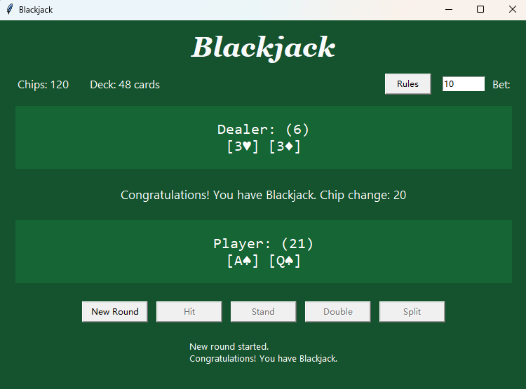

# Blackjack Game

A single-player Blackjack game where you play against a dealer. The project includes both a terminal interface and a Windows GUI build.



## Features

- Dealer-vs-player Blackjack gameplay
- Terminal mode for quick play and testing
- Tkinter GUI mode for desktop play
- One-command Windows executable build with PyInstaller

## Setup

```powershell
conda env update -f environment.yml --prune
```

## Test

```powershell
conda run -n blackjack-game pytest
```

## Play in Terminal

```powershell
conda run -n blackjack-game python -m blackjack.cli
```

## Play GUI

```powershell
conda run -n blackjack-game python -m blackjack.gui
```

## Build Windows EXE

```powershell
powershell -ExecutionPolicy Bypass -File .\scripts\build_exe.ps1
```

The build script converts the SVG card artwork in `assets\poker-super2-box-qr` to PNG files in `assets\cards`, then writes the executable to `dist\Blackjack.exe`.

The build script automatically finds `conda.exe` from your PATH or common Miniconda/Anaconda install locations. You can still pass a specific path if needed:

```powershell
powershell -ExecutionPolicy Bypass -File .\scripts\build_exe.ps1 -CondaExe "C:\Users\your-name\miniconda3\Scripts\conda.exe"
```
